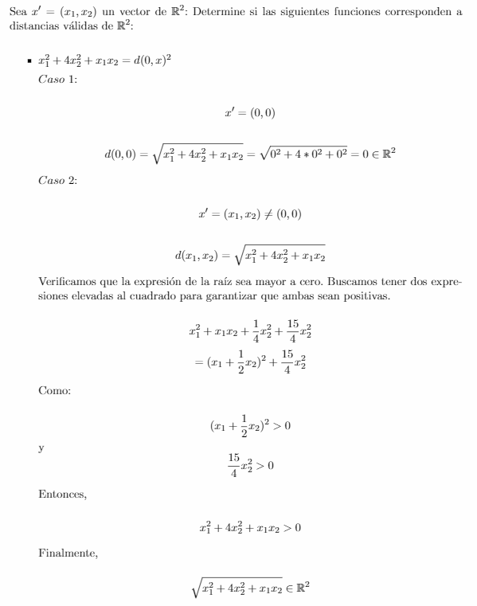
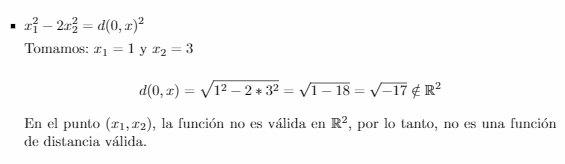
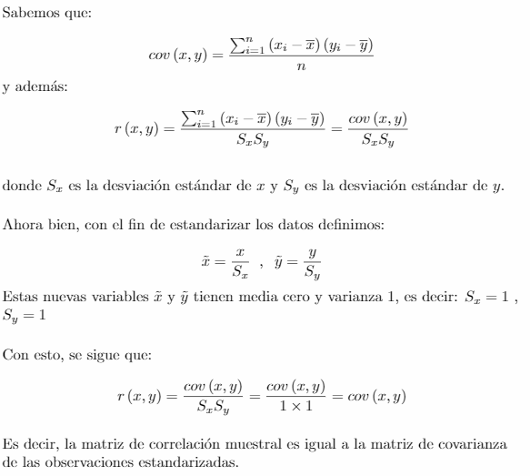

```{r setup, include=FALSE}
knitr::opts_chunk$set(echo = TRUE)
```

### Conceptos Previos
```{r}
#IMPORTANTE: Las imágenes adjuntadas deben estar guardadas 
#en la misma carpeta en la que se encuentre el código.

```

```{r}
packages = c("dslabs", "MASS", "scatterplot3d", "car")
## Se cargan o se instalan y cargan
package.check <- lapply(
  packages,
  FUN = function(x) {
    if (!require(x, character.only = TRUE)) {
      install.packages(x, dependencies = TRUE)
      library(x, character.only = TRUE)
    }
  }
)
```

# Punto 1

```{r}
boxplot(olive$oleic ~ olive$region, xlab='Region', ylab='Oleic')
```

# Punto 2

## 2a.

Medidas de tendencia central.

```{r}
#instalar libreria para la moda si no está instalada:
if(!require("modeest")){
    install.packages("modeest")
    library(modeest)
}
a<-mtcars

#Vector que almacena las medias estadísticas de cada una de las variables de
#mtcars en orden, es decir, (mpg,cyl,disp,...,gear,carb)
medias<-c() 

#Vector que almacena las modas estadísticas de cada una de las variables de
#mtcars en orden, es decir, (mpg,cyl,disp,...,gear,carb)
modas<-list()

#Vector que almacena las medianas estadísticas de cada una de las variables de
#mtcars en orden, es decir, (mpg,cyl,disp,...,gear,carb)
medianas<-c()

#Vector que almacena las desviaciones estandar de cada una de las variables de
#mtcars en orden, es decir, (mpg,cyl,disp,...,gear,carb)
desviaciones<-c()

for (i in seq_along(a)){
  media<-mean(a[[i]])
  medias<-c(medias,media)
  modas[[i]]<-mlv(a[[i]],method = "mfv")
  mediana<-median(a[[i]])
  medianas<-c(medianas,mediana)
  desviaciones<-c(desviaciones,sd(a[[i]]))
}

```

```{r}
message("Vector de medias: ")
medias 

message("Vector de medianas: ")
medianas

message("Vector de modas: ")
modas

message("Vector de desviaciones estandar: ")
desviaciones

```

Sí es posible calcular todas estas medidas de tendencia central puesto que son variables numericas. Sin embargo, en algunas variables como "vs", "am" no tiene sentido encontrar las medidad de tendecia central
como la media y la desviaciones estándar pues son variables cualitativas.

## 2b. 

Determinar qué variable presenta valores atípicos.

```{r}
boxplot(a$hp, main="Caballos de potencia (hp)")
boxplot(a$wt, main="Peso (wt)")
boxplot(a$qsec, main="Tiempo a 1/4 de milla (qsec)")
boxplot(a$carb, main="Número de carburadores (carb)")

```

Las variables que representan valores atípicos son: "hp": Caballos de potencia , "wt": Peso , "qsec": Tiempo a 1/4 milla , "carb": Número de carburadores. Se ha determinado que estas variables presentan valores atípicos por medio del diagrama de cajas, pues este nos permite visualizar datos que se encuentren fuera de las lineas rectas (representan valores con dispersion de 1.3 o 1.5).

## 2c.

Histogramas.

```{r}
#histograma por variables
hist(a$mpg, breaks=5)
hist(a$cyl, breaks=2) #no tiene sentido que sean 5 intervalos, var. categorica
hist(a$disp, breaks=5)
hist(a$hp, breaks=4)
hist(a$drat, breaks=5)
hist(a$wt, breaks=5)
hist(a$qsec, breaks=5)
hist(a$vs, breaks=2) #no tiene sentido utilizar histograma, variable categ.
hist(a$am, breaks=5) #no tiene sentido usar histograma, mejor utilizar diagrama de barras, var. categ.
hist(a$gear,breaks=5) #mejor diagrama de barras, la variable es categorica
hist(a$carb,breaks=5) #no se puede con 5 intervalos
```

## 2d. 

Boxplot de todas las variables

```{r}
boxplot(a, col = rainbow(ncol(trees)), main="Boxplot de todas las variables")
```

# Punto 3

```{r}
scatterplotMatrix(~ +., data = olive, diagonal=list(method ="boxplot")) 
```

# Punto 4

```{r}
colors <- c("#999999", "#E69F00", "#56B4E9")  
colors <- colors[as.numeric(olive$region)]
p_cuatro <- scatterplot3d(olive$palmitic,olive$palmitoleic,olive$linoleic,pch = 16, color=colors,xlab="Palmitic", ylab="Palmitoleic", zlab="Linoleic")

legend(p_cuatro$xyz.convert(-3.0, 5, 14), legend = levels(olive$region), col =  c("#999999", "#E69F00", "#56B4E9"), pch = 16)
```

# Punto 5

## 5a.

```{r}
x1 <- c(-6, -3, -2, 1, 2, 5, 6, 8)
x2 <- c(-2, -3, 1, -1, 2, 1, 5, 3)


xb1<-mean(x1)
xb2<-mean(x2)

plot(x1,x2,xlab='x_1', ylab='x_2')

s11 = (1/8)*sum((x1-xb1)^2)
s22 = (1/8)*sum((x2-xb2)^2)
s12 =(1/8)*sum((x1-xb1)*(x2-xb2))
```

```{r}
s11
s22
s12
```

## 5b.

```{r}
x1_cosito = x1*cos(26*pi/180) + x2*sin(26*pi/180)
x2_cosito = -x1*sin(26*pi/180) + x2*cos(26*pi/180)
```

```{r}
x1_cosito

x2_cosito
```

## 5c.

```{r}
xb1_cosito <-mean(x1_cosito)
xb2_cosito <-mean(x2_cosito)

S_11_cosito = (1/8)*sum((x1_cosito-xb1_cosito)^2)
S_22_cosito = (1/8)*sum((x2_cosito-xb2_cosito)^2)
```

```{r}
xb1_cosito
xb2_cosito
S_11_cosito
S_22_cosito
```

## 5d.

```{r}
x1_nuevo_gorro = 4*cos(26*pi/180) - 2*sin(26*pi/180)
x2_nuevo_gorro = -4*sin(26*pi/180) -2*cos(26*pi/180)

distancia = sqrt(((x1_nuevo_gorro)^2/S_11_cosito)+((x2_nuevo_gorro)^2/S_22_cosito))
```

```{r}
x1_nuevo_gorro
x2_nuevo_gorro
distancia
```

## 5e.

```{r}
t = 26*pi/180
a = (cos(t)^2)*s11 + 2*sin(t)*cos(t)*s12 + (sin(t)^2)*s22
b = (cos(t)^2)*s22 - 2*sin(t)*cos(t)*s12 + (sin(t)^2)*s11

a11 = ((cos(t)^2)/a) + ((sin(t)^2)/b)
a22 = ((sin(t)^2)/a) + ((cos(t)^2)/b)
a12 = ((sin(t)*cos(t))/a) - ((sin(t)*cos(t))/b)

uno = a11*(16)
dos = a12*(-16)
tres = a22*4 

distancia_est = sqrt(uno+dos+tres)
```

```{r}

a11
a22
a12
distancia_est
```

# Punto 6

## a.

##  

## b.

{width="602"}

# Punto 7




