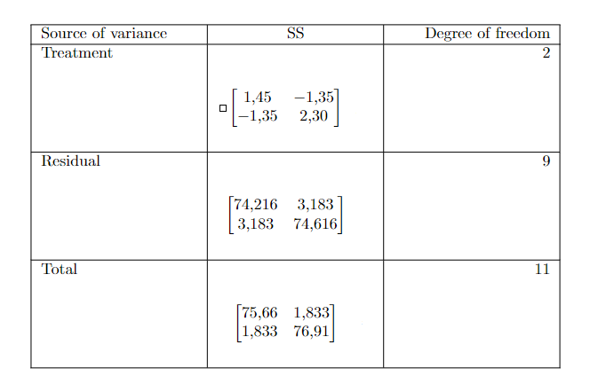

```{r setup, include=FALSE}
knitr::opts_chunk$set(echo = TRUE)
```

# Punto 1

Un investigador considera tres índices para medir la severidad de los
ataques corazón. Los valores de esos indices para $n=40$ pacientes con
ataque al corazón que llegan a las emergencias de un hospital producen
las siguientes estadísticas resumidas.

$$
\overline{\mathbf{x}}=\left[\begin{array}{l}
46.1 \\
57.3 \\
50.4
\end{array}\right] \hspace{0.1cm} y \hspace{0.3cm}  \mathbf{S}=\left[\begin{array}{rrr}
101.3 & 63.0 & 71.0 \\
63.0 & 80.2 & 55.6 \\
71.0 & 55.6 & 97.4
\end{array}\right]
$$ **(a)** Los tres índices son evaluados para cada paciente. Realice
una prueba para la igualdad de las medias de los indices con
$\alpha=0.05$.

```{r}

n<-40
q<-3
Xbarra<-matrix(c(46.1,57.3,50.4),nrow=3)
S<-matrix(c(101.3,63,71,63,80.2,55.6,71,55.6,97.4),nrow=3,ncol=3)
alpha<-0.05

#Prueba de hipotesis para la igualdad de las medias, es decir, H0: u1=u2=u3=0
C<-matrix(c(1,-1,0,1,0,-1),ncol=3,nrow=2,byrow=TRUE)

prueba<-C%*%Xbarra

#Estadistico de prueba T^2
Tsquare<-n*(t(C%*%Xbarra)%*%solve(C%*%S%*%t(C))%*%(C%*%Xbarra))

comp<-((n-1)*(q-1))/(n-q+1)*qf(alpha,q-1,n-q+1,lower.tail = FALSE)

#Puesto que Tsquare > comp, se rechaza H0
```

Como $T^2 >$ comp se rechaza $H_0$, es decir, las medias no son iguales.

**(b)** Juzgue las diferencias entre pares de las medias de los índices
usando intervalos de confianza $\left(T^{2}\right)$ simultáneos del
$95 \%$

```{r}
#b.) Intervalos de confianza simultaneos del 95%
intervalos<-list()
for (i in 1:2) {
  temp<-sqrt(comp)*sqrt((C[i,]%*%S%*%C[i,])/n)
  intervalos[[i]]<-c(C[i,]%*%Xbarra-temp,C[i,]%*%Xbarra+temp)
}

intervalos

#u1-u2: (x1barra-x2barra) +- sqrt(...)*sqrt(CSC/n)
#u1-u3: (x1barra-x3barra) +- sqrt(...)*sqrt(CSC/n)
```

A partir de los intervalos prodemos determinar que ninguno de los
intervalos contiene al cero, luego H0 debe ser rechazada.

# Punto 2

Observaciones sobre dos respuestas fueron coleccionadas para dos
tratamientos Las observaciones vectoriales $[x 1, x 2]^{\prime}$ fueron:

Tratamiento 2:
$$Tratamiento \hspace{0.1cm}2:\left[\begin{array}{l}3 \\ 3\end{array}\right], \quad\left[\begin{array}{l}1 \\ 6\end{array}\right], \quad\left[\begin{array}{l}2 \\ 3\end{array}\right]$$

Tratamiento 3:
$$Tratamiento \hspace{0.1cm}3:\left[\begin{array}{l}2 \\ 3\end{array}\right], \hspace{0.2cm}\left[\begin{array}{l}5 \\ 1\end{array}\right], \quad\left[\begin{array}{l}3 \\ 1\end{array}\right], \quad\left[\begin{array}{l}2 \\ 3\end{array}\right]$$

```{r}
n2 <- 3
n3 <- 4
p <- 2
X2_1 <- c(3,1,2)
X2_2 <- c(3,6,3)
X2 <- t(rbind(X2_1,X2_2))
X3_1 <- c(2,5,3,2)
X3_2 <- c(3,1,1,3)
X3 = t(rbind(X3_1,X3_2))

#Las filas representan las variables

S2 <- cov(X2)
S3 <- cov(X3)
Spooled <-  (( ((n2-1)*S2) + ((n3-1)*S3) ) / (n2+n3-2))
Spooled
```

**(b)** Realice la prueba
$H_{0}: \boldsymbol{\mu}{2}-\boldsymbol{\mu}{3}=\mathbf{0}$ usando un
enfoque de dos muestras con $\alpha=.01$.

```{r}

#Ho: u2 = u3 => delta_0 es = 0
alpha = 0.01
X2_barra = rbind(mean(X2_1),mean(X2_2))
X3_barra = rbind(mean(X3_1),mean(X3_2))

#Asumimos normalidad para usar Tsquare pues n-p en cada caso no es grande.
frac = (n3+n2)/(n3*n2)
Tsquared = t(X2_barra-X3_barra) %*% solve(frac*Spooled) %*% (X2_barra-X3_barra)
frac2 = (p*(n2+n3-2) ) / (n2+n3-p-1)
f_p_n_n = qf(1-alpha, p, (n2+n3-p-1))
c_squared = f_p_n_n * frac2

sprintf(" Tsquared: %s",Tsquared )
sprintf(" c_squared: %s",c_squared)

#Si Tsqared es mayor a 45 entonces no se acepta la prueba de hipótesis con una confianza del 99%

#Puesto que Tsquared es mayor a 45, no se rechaza H0
```

Puesto que $T^2$ $\ngtr$ c_squared, no se rechaza $H_0$

**(c)** Construya un intervalo de confianza simultáneo
$\left(T^{2}\right)$ del $99 \%$ para las diferencias
$\mu_{2 i}-\mu_{3 i}, i=1,2$

```{r}
c = sqrt(c_squared)

a = c(1,0) #Para la variable 1
low_lim = (t(a) %*% (X2_barra - X3_barra) ) + (c * sqrt( frac * t(a) %*% Spooled %*% a))
upp_lim = (t(a) %*% (X2_barra - X3_barra) ) - (c * sqrt( frac * t(a) %*% Spooled %*% a))
intervalo = c(low_lim,upp_lim) 
print('Intervalo para la variable 1')
print(t(intervalo))
a = c(0,1) #Para la variable 2
low_lim = (t(a) %*% (X2_barra - X3_barra) ) + (c * sqrt( frac * t(a) %*% Spooled %*% a))
upp_lim = (t(a) %*% (X2_barra - X3_barra) ) - (c * sqrt( frac * t(a) %*% Spooled %*% a))
intervalo = c(low_lim,upp_lim)
print('Intervalo para la variable 2')
print(t(intervalo))
```

# Punto 3


**(a)** Ajuste el modelo de regresión lineal

```{r}
z_0 <- c(1,1,1,1,1,1)
z_1 <- c(10,5,7,19,11,18)
z_2 <- c(2,3,3,6,7,9)

y <- c(15,9,3,25,7,13)

Z = cbind(z_0,z_1,z_2)
Y = cbind(y)

betas = (solve(t(Z)%*%Z))%*%t(Z)%*%Y
betas
Y_est<-Z%*%betas
E_est<-Y-Y_est

```

Luego, el modelo es
$Y = 2.15 + 1.78 z_{j1} - 2.19 z_{j2} + \varepsilon_j$, $j=1,2,...,6$
donde $\varepsilon' = `r E_est`$

**(b)** Determine los intervalos de confianza del $95 \%$ simultáneos
(uno a la vez) para $\beta_{1} \mathrm{y} \beta_{2}$.

```{r}

#Para B1
error = (diag(6)-(Z%*%solve(t(Z)%*%Z)%*%t(Z)))%*%Y
 

S_cuadrado = (t(error)%*%error)/(6-2-1)


Matriz_S = S_cuadrado[1,1]*solve(t(Z)%*%Z)
f1 = qf(1-0.05, df1 = 3, df2=6-2-1)

inferior_b1 = betas[2] - sqrt(Matriz_S[2,2]) * sqrt((3)*f1)
superios_b1 = betas[2] + sqrt(Matriz_S[2,2]) * sqrt((3)*f1)
inferior_b1
superios_b1


#Para B2


inferior_b2 = betas[3] - sqrt(Matriz_S[3,3]) * sqrt((3)*f1)
superios_b2 = betas[3] + sqrt(Matriz_S[3,3]) * sqrt((3)*f1)
inferior_b2
superios_b2


```

Luego, el intervalo de confianza para B1 es
$\left[\begin{array}{l}-0.84 , 4.41\end{array}\right]$ y el intervalo de
confianza para B2 es
$\left[\begin{array}{l}-7.63,3.26\end{array}\right]$

**(c)** Comprueba la prueba de hípótesis nula de que sólo el coeficiente
$\beta_{1}$ es cero.

```{r}

summary(lm(Y~z_1+z_2))


```

Como el p-valor \> a 0.05 no rechazamos $H_0$, por lo que $\beta_1=0$ .

**(d)** Determine el valor esperado de la predicción $(E(Y))$ para
$z_{1}=6 \mathrm{y}_{2}=$ 4. Calcule su intervalo de confianza del
$95 \%$ correspondiente (el del valor esperado).

```{r}

Z_valor_inical = c(1, 6, 4) #Se pone un 1 por B0


Esperado_Y = t(Z_valor_inical)%*%betas


esta_t = qt((1-0.025),df = 3 )


inferior_val_esp = Esperado_Y - esta_t*sqrt((t(Z_valor_inical)%*%solve(t(Z)%*%Z)%*%Z_valor_inical)%*%S_cuadrado)
superior_val_esp = Esperado_Y + esta_t*sqrt((t(Z_valor_inical)%*%solve(t(Z)%*%Z)%*%Z_valor_inical)%*%S_cuadrado)

inferior_val_esp
superior_val_esp

```

Luego, el intervalo de confianza para El valor esperado es
$\left[\begin{array}{l}-4.71,12.9\end{array}\right]$

**(e)** Determine el intervalo de confianza del $95 \%$ para la
predicción $(Y)$ cuando $z_{1}=6 \mathrm{y} z_{2}=4$

```{r}

inferior_prediccion = Esperado_Y - esta_t*sqrt((1+(t(Z_valor_inical)%*%solve(t(Z)%*%Z)%*%Z_valor_inical))%*%S_cuadrado)
superior_prediccion = Esperado_Y + esta_t*sqrt((1+(t(Z_valor_inical)%*%solve(t(Z)%*%Z)%*%Z_valor_inical))%*%S_cuadrado)


inferior_prediccion
superior_prediccion

```

Luego, el intervalo de confianza para la predicción es
$\left[\begin{array}{l}-12 , 20.1\end{array}\right]$

# Punto 4

La librería MASS (carguela con library (MASS)) contiene el dataset de
Boston, el cual registró la variable medv (valor medio de una casa) para
506 barrios en Boston. En este ejercicio, se buscará predecir la
variable medv usando 13 predictores tales como: rm (número promedio de
habitaciones por casa), age (promedio de la edad de las casas), y lstat
(porcentaje de hogares con bajo nivel socioeconómico).

Para este ejercicio puede usar la función lm de $\mathrm{R}$.

**(a)** Realice el ajuste de regresión lineal simple usando como
variable independiente lstat. Realice un resumen de los resultados (use
la función summary). ¿Es la pendiente (coeficiente asociado a lstat)
cero? Justifique estadísticamente su respuesta.

```{r}
require(MASS)
data("Boston")

summary(Boston)
# A
#cargamos el data frame del modelo, lo haremos para medv y lstat, tomando lstat como variable independiente
modelo <- lm(data = Boston, formula = medv ~ lstat)
modelo
summary(modelo) #resumen de los resultados 
```

Por medio de la funcion summary podemos ver que el coeficiente asociado
a lsat es igual a -0.95005, el cual es diferente de cero. Esto significa
que la variable independiente lsat influye en la variable dependiente
mdev

**(b)** Determine el intervalo de confianza del $95 \%$ para los
coeficientes (use la función confint().

```{r}
confint(modelo,level=0.95)
```

**(c)** Realice las predicciones para el valor esperado de medv y los
correspondientes intervalos de confianza del $95 \%$ para los valores de
lstat=c $(5,10,15)$. Sugerencia: use predict(). Determine el intervalo
de confianza para la predicción (no el valor esperado).

```{r}
#se realizan las predicciones para el valor esperado de medv y los correspondientes intervalos de confianza del
#95% para los valores de lstat=c(5,10,15) (porcentajes de pobreza). Para esto nos ayudamos de la función predict

#intervalo de PREDICCION para el valor ESPERADO de medv teniendo en cuenta lstat=c(5,10,15) 
predict(object = modelo, newdata = data.frame(lstat = c(5,10,15)),
        interval = "prediction", level = 0.95)

#devuelve el intervalo de confianza para el valor PROMEDIO de medv, cuando lstat=c(5,10,15)
predict(object = modelo, newdata = data.frame(lstat = c(5,10,15)),
        interval = "confidence", level = 0.95) 
```

**(d)** Grafique el diagrama de dispersion de medv y lstat y la recta de
regresión (use abline).

```{r}
#Diagrama de dispersión de medv y lstat y la recta de regresión (abline)
attach(Boston)
plot(x =lstat, y = medv, main = "medv vs lstat", pch = 20, col = "grey30")
abline(modelo, lwd = 3, col = "red")   
```

**(e)** Realice la regresión lineal de medv utilizando todas las
variables independientes. Determine los intervalos de confianza del
$95 \%$ de los coeficientes asociados a las variables independientes.

```{r}
#Realizamos el modelo de regresion lineal usando todas las variables independientes (regresion multiple)
modelo2 <- lm(data = Boston, formula = medv ~ .)
modelo2
summary(modelo2) 
```

**(f)** Con el modelo anterior (e) determine el intervalo de confianza
del $95 \%$ del valor esperado de medv para el valor promedio de las
variables independientes. Ahora, determine el intervalo de confianza del
$95 \%$ para la predicción usando el mismo vector de entrada.

```{r}
#intervalo de conf. del 95% del valor esperado de medv para el valor promedio de las variables indep.

modelo3 <- lm(data = Boston, formula = medv ~ crim + zn + chas + nox + rm + dis + rad + tax + ptratio + black + lstat)
#quitamos las variables que no aportan gran significancia al modelo de regresion lineal (indus, age)
modelo3
summary(modelo3)
 
confint(modelo3,level=0.95) 
```

# Punto 5

Se realizan observaciones de dos respuestas sobre tres tratamientos. Los
vectores de observación
$\left[\begin{array}{l}x_{1} \\ x_{2}\end{array}\right]$ son:

**Tratamiento 1:**

$$
\left[\begin{array}{l}2 \\ 9\end{array}\right],\left[\begin{array}{l}3 \\ 2\end{array}\right],\left[\begin{array}{l}7 \\ 5\end{array}\right],\left[\begin{array}{l}2 \\ 1\end{array}\right],\left[\begin{array}{l}7 \\ 5\end{array}\right]
$$

**Tratamiento 2:** $$
\left[\begin{array}{l}3 \\ 2\end{array}\right], \quad\left[\begin{array}{l}2 \\ 4\end{array}\right],\left[\begin{array}{l}9 \\ 4\end{array}\right]
$$

**Tratamiento 3:**

$$
\left[\begin{array}{l}1 \\ 4\end{array}\right],\left[\begin{array}{l}7 \\ 2\end{array}\right],\left[\begin{array}{l}4 \\ 9\end{array}\right],\left[\begin{array}{l}3 \\ 2\end{array}\right]
$$

**(a)** Construya la tabla de one-way MANOVA.

```{r}

#Primera población

n_1 = 5

a_1 <- cbind(c(2,9))
a_2 <- cbind(c(3,2))
a_3 <- cbind(c(7,5))
a_4 <- cbind(c(2,1))
a_5 <- cbind(c(7,5))

media_a = (a_1 + a_2 + a_3 + a_4 + a_5) /n_1

S1 = (a_1 - media_a)%*% t(a_1 - media_a)+(a_2 - media_a)%*% t(a_2 - media_a)+(a_3 - media_a)%*% t(a_3 - media_a)+(a_4 - media_a)%*% t(a_4 - media_a)+(a_5 - media_a)%*% t(a_5 - media_a)


#Segunda población

n_2 = 3

b_1 <- cbind(c(3,2))
b_2 <- cbind(c(2,4))
b_3 <- cbind(c(9,4))


media_b = (b_1 + b_2 + b_3 ) /n_2

S2 = (b_1 - media_b)%*% t(b_1 - media_b)+(b_2 - media_b)%*% t(b_2 - media_b)+(b_3 - media_b)%*% t(b_3 - media_b)


#Tercera población

n_3 = 4

c_1 <- cbind(c(1,4))
c_2 <- cbind(c(7,2))
c_3 <- cbind(c(4,9))
c_4 <- cbind(c(3,2))

media_c = (c_1 + c_2 + c_3 + c_4) /n_3

S3 = (c_1 - media_c)%*% t(c_1 - media_c)+(c_2 - media_c)%*% t(c_2 - media_c)+(c_3 - media_c)%*% t(c_3 - media_c)+(c_4 - media_c)%*% t(c_4 - media_c)


#Población total:

media_total = (a_1 + a_2 + a_3 + a_4 + a_5 + b_1 + b_2 + b_3 +c_1 + c_2 + c_3 + c_4) /(n_1+n_2+n_3)

#Para x1

#T1

prim = n_1*((media_a[1] - media_total[1])^2) + n_2*((media_b[1] - media_total[1])^2) + n_3*((media_c[1] - media_total[1])^2)

#T2

sec = n_1*((media_a[2] - media_total[2])^2) + n_2*((media_b[2] - media_total[2])^2) + n_3*((media_c[2] - media_total[2])^2)


diag = n_1*((media_a[1] - media_total[1])*(media_a[2] - media_total[2])) + n_2*((media_b[1] - media_total[1])*(media_b[2] - media_total[2])) + n_3*((media_c[1] - media_total[1])*(media_c[2] - media_total[2]))

r_1 <- rbind(c(prim,diag))
r_2 <- rbind(c(diag,sec))

SStreat <- rbind(r_1,r_2)
SStreat


#E1

e1 = ((a_1[1]-media_a[1])^2) + ((a_2[1]-media_a[1])^2) + ((a_3[1]-media_a[1])^2) + ((a_4[1]-media_a[1])^2) + ((a_5[1]-media_a[1])^2)+ ((b_1[1]-media_b[1])^2) + ((b_2[1]-media_b[1])^2) + ((b_3[1]-media_b[1])^2)+ ((c_1[1]-media_c[1])^2) + ((c_2[1]-media_c[1])^2) + ((c_3[1]-media_c[1])^2) + ((c_4[1]-media_c[1])^2)


#E2

e2 = ((a_1[2]-media_a[2])^2) + ((a_2[2]-media_a[2])^2) + ((a_3[2]-media_a[2])^2) + ((a_4[2]-media_a[2])^2) + ((a_5[2]-media_a[2])^2)+ ((b_1[2]-media_b[2])^2) + ((b_2[2]-media_b[2])^2) + ((b_3[2]-media_b[2])^2)+ ((c_1[2]-media_c[2])^2) + ((c_2[2]-media_c[2])^2) + ((c_3[2]-media_c[2])^2) + ((c_4[2]-media_c[2])^2)

#Ediag

ediag = ((a_1[1]-media_a[1])*(a_1[2]-media_a[2])) + ((a_2[1]-media_a[1])*(a_2[2]-media_a[2])) + ((a_3[1]-media_a[1])*(a_3[2]-media_a[2])) + ((a_4[1]-media_a[1])*(a_4[2]-media_a[2])) + ((a_5[1]-media_a[1])*(a_5[2]-media_a[2]))+ ((b_1[1]-media_b[1])*(b_1[2]-media_b[2])) + ((b_2[1]-media_b[1])*(b_2[2]-media_b[2])) + ((b_3[1]-media_b[1])*(b_3[2]-media_b[2]))+ ((c_1[1]-media_c[1])*(c_1[2]-media_c[2])) + ((c_2[1]-media_c[1])*(c_2[2]-media_c[2])) + ((c_3[1]-media_c[1])*(c_3[2]-media_c[2])) + ((c_4[1]-media_c[1])*(c_4[2]-media_c[2]))

e_1 <- rbind(c(e1,ediag))
e_2 <- rbind(c(ediag,e2))

SSres <- rbind(e_1,e_2)
SSres

SScorrel <- SStreat + SSres
SScorrel

```

```{r}
#Importante: Par visualizar la tabla la imagen TablaMANOVA debe estar en la misma carpeta
#de este archivo .rmd
```



**(b)** Evalue el Lambda de Wilk, $\Lambda *$, y realice una prueba de
hipótesis sobre los efectos de tratamientos. Sea $\alpha=.05$.

```{r}

lamda_wilk = det(SSres)/det(SScorrel)


Est_prueb = ((12-3-1)/2-1)*((sqrt(1-lamda_wilk))/sqrt(lamda_wilk))
Est_prueb

f = qf(p=0.05, df1=4,df2= 16, lower.tail= FALSE)
f

```

Como Est_prueba \< f, no rechazamos $H_0$, es decir, no existe
diferencias en los tratamientos.

**(c)** Repita la prueba considerando que la muestra es grande.

```{r}

lamda_wilk2 = det(SSres)/det(SScorrel)


Est_prueb2 = ((100-3-1)/2-1)*((sqrt(1-lamda_wilk2))/sqrt(lamda_wilk2))
Est_prueb2


f2 = qf(p=0.05, df1=4,df2= 16, lower.tail= FALSE)
f2

```

En una muestra grande, Est_prueba \> f, rechazamos H0, es decir, sí
existiría diferencias en los tratamientos.
